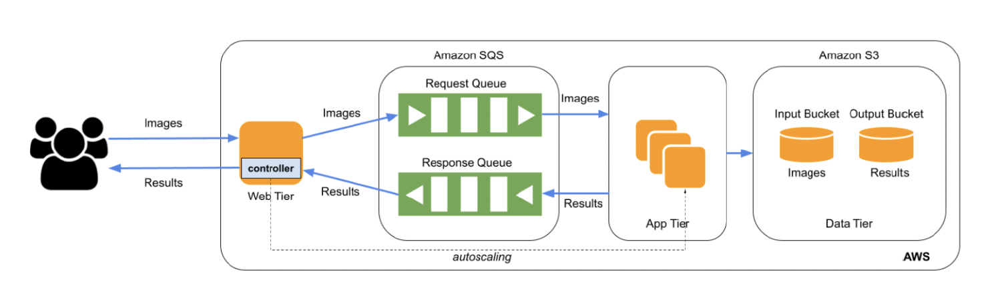

# Project 2: Serverless and Elastic Face Recognition on AWS

This project implements a multi-tier, cloud-native face recognition pipeline using AWS services. It combines serverless and elastic compute design principles to provide a scalable application capable of processing video and image-based facial recognition tasks.

## 🧠 Overview

- **Part 1 (Serverless Architecture)**: Uses AWS Lambda and S3 to perform face detection on uploaded videos. It extracts frames using FFmpeg and runs inference using a pre-trained CNN model.
- **Part 2 (Elastic IaaS Architecture)**: Builds a multi-tier application with a custom autoscaling App Tier on EC2. It processes image classification requests from users via a single persistent Web Tier, manages job queues with SQS, and stores input/output via S3.

## 🕸 Web Tier

- Runs on a persistent EC2 instance (`web-instance`)
- Handles HTTP POST requests with `.jpg` images under the key `inputFile`
- Sends image classification requests to the App Tier using SQS
- Receives classification results from the App Tier via a response queue
- Responds with the format: `<filename>:<classification_result>`
- Manages autoscaling of the App Tier using a custom scaling algorithm (no AWS autoscaling used)

## ⚙️ App Tier

- Composed of EC2 instances that are launched and terminated based on request load
- Instances are launched using a custom AMI that contains the face recognition model
- Model is based on PyTorch and uses CPU inference
- Each instance:
  - Polls the request queue
  - Downloads the image from S3
  - Runs inference
  - Uploads the result to the output S3 bucket
  - Sends result to the response SQS queue

## 🗂 Data Tier

- Uses two S3 buckets:
  - **Input Bucket** (`<ASU_ID>-in-bucket`) to store incoming images
  - **Output Bucket** (`<ASU_ID>-out-bucket`) to store classification results
- SQS Queues:
  - **Request Queue** (`<ASU_ID>-req-queue`) for Web → App tier communication
  - **Response Queue** (`<ASU_ID>-resp-queue`) for App → Web tier results

## 🧪 Testing & Validation

- **Workload Generator** and **Grading Scripts** were used for validation
- App Tier successfully scaled between 0 and 20 instances
- All requests processed correctly within latency constraints (≤ 80 sec for 100 requests)
- High accuracy achieved using the provided labeled dataset

## ✅ Notes

- All AWS resources are hosted in the `us-east-1` region
- IAM roles used with appropriate permissions: EC2 ReadOnly, S3 FullAccess, SQS FullAccess
- System tested with 10 and 50 concurrent image requests
- Final results verified using the grading script and dataset statistics

## 🗺 Architecture

